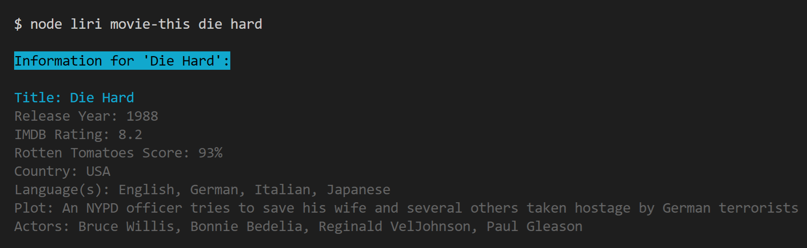
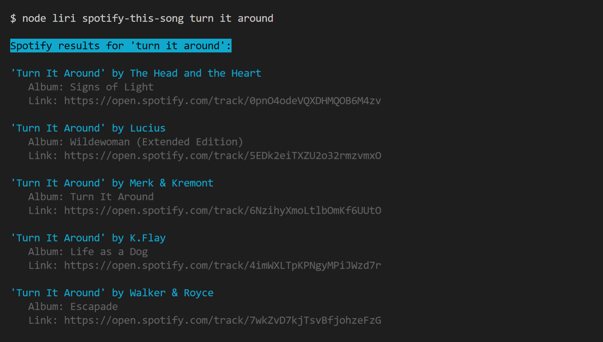
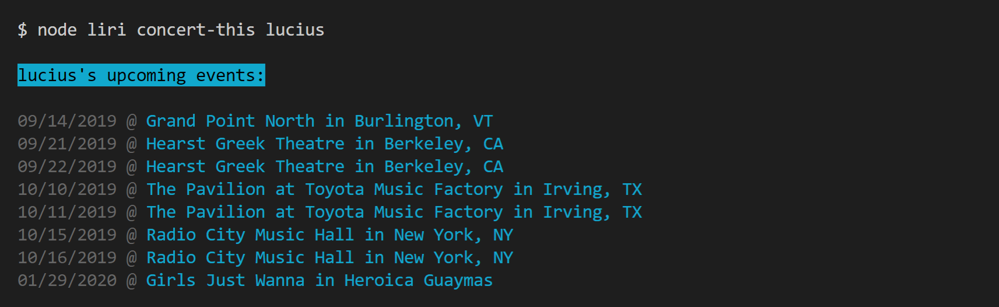
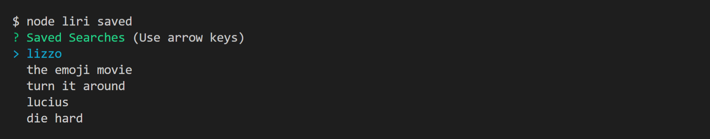
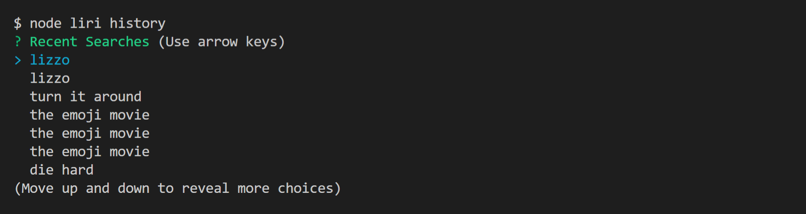
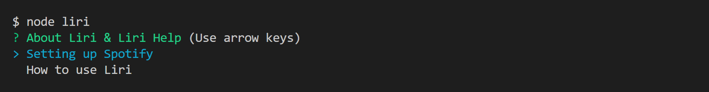
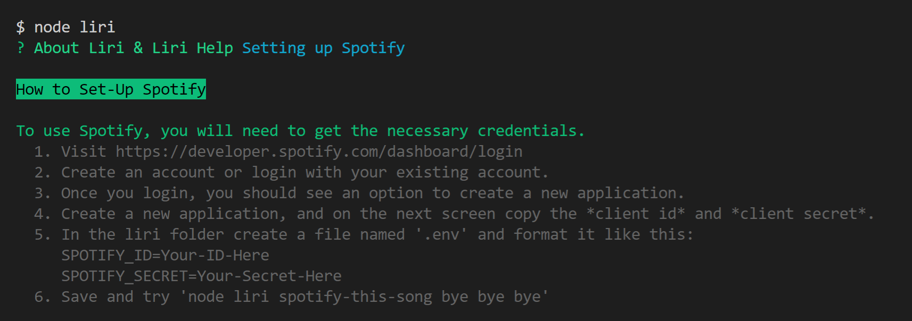
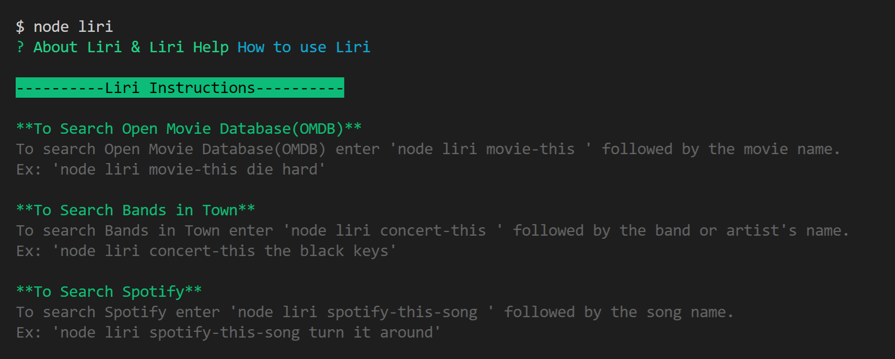

# Liri Node App

Liri is a node.js application that can search the Spotify, Open Movie Database, and the Bands in Town APIs.

*Installation*
* [How to Install](#liri-set-up)
* [Setting up Spotify](#spotify-set-up)

*How to Use*
* [Search Open Movie Database](#search-open-movie-database)
* [Search Spotify](#search-spotify)
* [Search Bands in Town](#search-bands-in-town)
* [Save Searches](#save-searches)
* [Access Saved Searches and History](#access-saved-searches-and-history)
* [Recieve Random Results](#random-results)
* [Liri Help](#liri-help)

---
### Liri Set-Up
 1. First, clone the repository to your computer.
 2. Then, navigate to the folder in terminal/git bash. Type npm install to install all necessary node.js modules. (If node.js is not installed, see this link on how to install: https://nodejs.org/en/download/)
 3. See the next section about [setting up Spotify](#spotify-set-up).

---
### Spotify Set-Up
To set up spotify, you'll need generate *client id* and *client secret* with Spotify. See directions below.
 1. Visit https://developer.spotify.com/dashboard/login
 2. Create an account or login with your existing account.
 3. Once you login, you should see an option to create a new application.
 4. Create a new application, and on the next screen copy the *client id* and *client secret*.
 5. In the liri folder create a file named '.env' and format it like this:  SPOTIFY_ID=Your-ID-Here  SPOTIFY_SECRET=Your-Secret-Here
 6. Save and try 'node liri spotify-this-song bye bye bye'

---
### Search Open Movie Database
*Command format:*
```
node liri movie-this your movie name
```

*Example:*
```
node liri movie-this die hard
```

*Example Response:*

  
---
### Search Spotify
*Command format:*
```
node liri spotify-this-song your movie name
```

*Example:*
```
node liri spotify-this-song turn it around
```

*Example Response:*


---
### Search Bands in Town
*Command format:*
```
node liri concert-this artist name
```

*Example:*
```
node liri concert-this the black keys
```

*Example Response:*


---
### Save Searches
After searching, you can save your search with the save-last command.

*Command format:*
```
node liri save-last
```

---
### Access Saved Searches and History
You can access your saved searches and history using the following commands. After entering either of these commands, you will recieve a prompt allowing you to select a previous search and recieve the results.

*Command format to access saved searches:*
```
node liri saved
```
*Example Response:*




*Command format to access history:*
```
node liri history
```

*Example Response:*


---
### Random Results

To receive a random result, use the following command:

*Command format*
```
node liri random
```

---
### Liri Help

*Command format:*
```
node liri
```
OR
```
node liri help
```

*Response:*


*Spotify Help Response:*


*Liri Instructions Response:*


